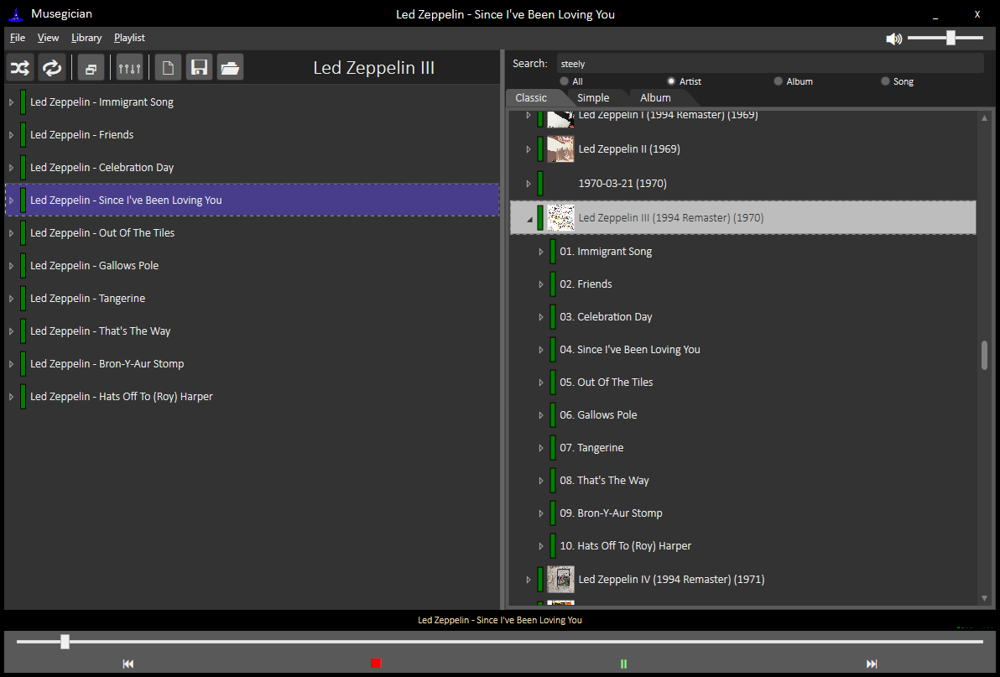
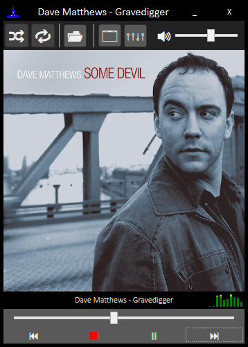
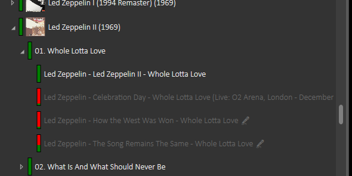
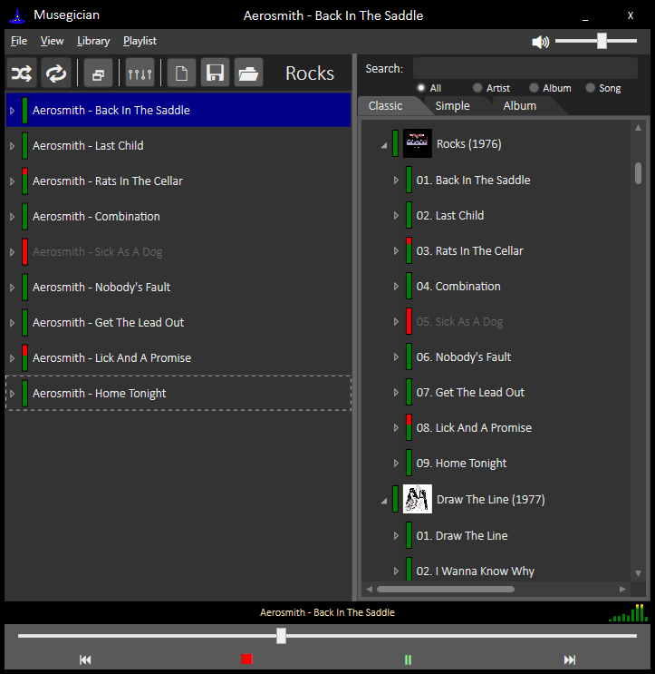
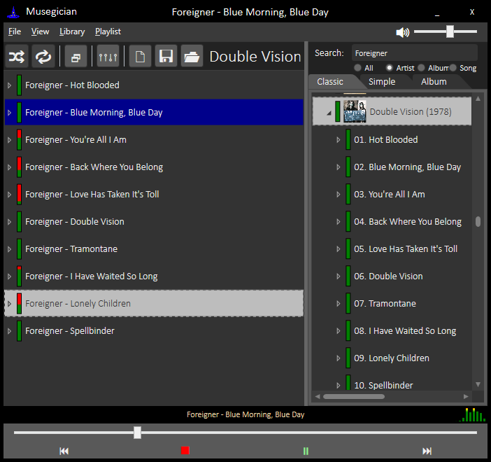
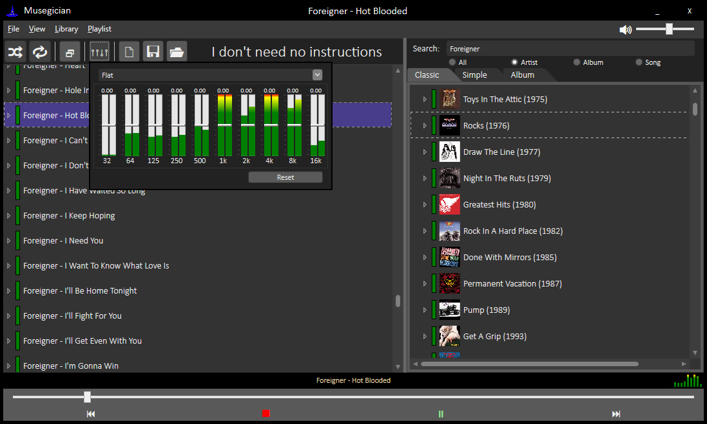

# Musegician

Pronouced like a portmanteau of Magician and Musician - Musegician was designed to feel like extruding a mouthful of gravel through gritted teeth.

The goal of this project is to provide a relatively lightweight and zippy musicplayer with more intelligent playlists.  Where appropriate and discernable, live recordings will end up nested under their associated studio recording, and the "song" itself is added to playlists.  There will be a modifiable, global probability when playing a given song that a live recording will be substituted in its place, and this weighting value will be individually modifiable.  Additionally, songs themselves will have modifiable global- and playlist-specific weights allowing you to tune the distributions without needing to actually cull songs from your music collection.

If you're interested in giving it a try, just grab it from [The Releases Page](https://github.com/tstavropoulos/Musegician/releases).  Unfortunately, because of the framework it was developed in, only Windows is supported at this time.

This scheme implicitly depends on good quality metadata tags, and as such I am working on a good scheme for updating them.

## Features

Musegician is currently a full-featured MP3 player with several possible views.

The Classic Library and Playlist browser...  

And an always-on-top Tiny Player.  

You should be able to use the media buttons on your keyboard to manipulate the playing track.  The classic player also allows you to look at your library without showing the albums, or even a view that just lists all of your albums.

### Live Songs and Weights

What's different about it is that it understands the concept of a "song", and can cluster together different recordings of the same song.  It allows you to set a relative preference between different songs and recordings, making one play more frequently than another.  It also supports the concept of "live recordings", and by default sets the weight of live recordings to a lower value.  

You can independently manipulate the weights of different recordings, away from their default values, by pressing the + and - keys.  

You can select multiple tracks at once, modifying all their weights simultaneously, or modifying their data in the Database and even push these updates to their ID3 tags.  

### Playlists

When songs are added to a playlist, their weights are carried over automatically (based on context).  

But songs in the playlist also retain their independence, allowing you to create different playlists that have different weights for the same songs.  

You can Load Playlists...  

and Save Playlists.  

### Playback

Built into the player is an Equalizer.  

### Installer

And now it's packaged with an installer that will handle the installation of the requirements for you.  Just grab it from [The Releases Page](https://github.com/tstavropoulos/Musegician/releases).

## Development

Requirements:
* Visual Studio 2017
* .NET 4.7.1 framework (or better)  [Available Here](https://www.microsoft.com/net/download/thank-you/net471-developer-pack)

## About The Developer

I like Music.  I like the artistic vision that Studio Recordings represent.  I like occasionally listening to live recordings of music.  I do not like it when a music player's Shuffle results in too many live recordings playing.  I hate it when a music player's Shuffle plays two different recordings of the same song back-to-back.  I would like to fix that.
