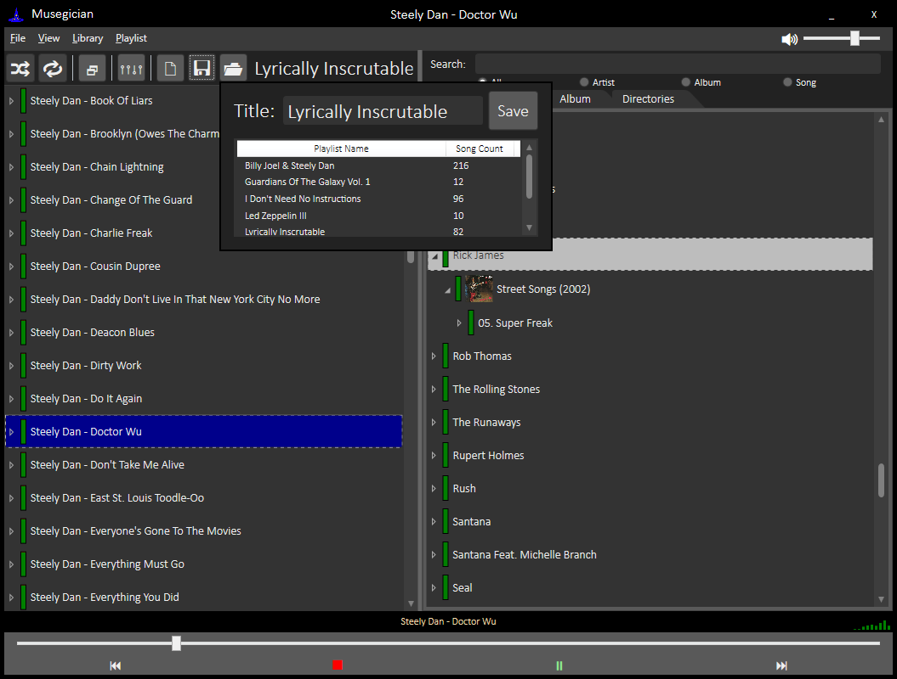
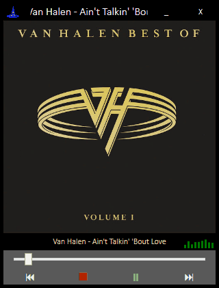
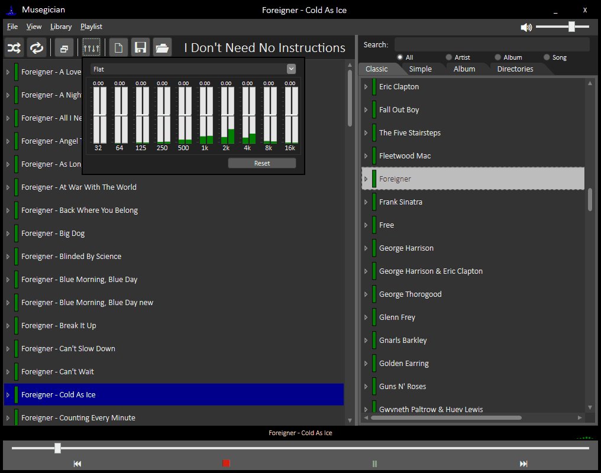

# Musegician

Pronouced like a portmanteau of Magician and Musician - the name _Musegician_ was designed to feel like extruding a mouthful of gravel through gritted teeth.

The initial goal of this project was to provide a relatively lightweight musicplayer with more intelligent shuffle behavior.  On initially importing a music library, some simple heuristics will attempt to determine unique songs and artists, and identify live recordings, though there is an expanding set of tools available to manually update this data.  Live recordings end up nested under their associated song, along with the studio recording, and the "song" itself can be added to playlists.  There is a modifiable, global default probability when playing a given song that a live recording will be substituted in its place, and this weighting value is also individually modifiable.  Additionally, songs themselves have modifiable global- and playlist-specific weights allowing you to tune the distributions without needing to actually cull songs from your music collection.

If you're interested in giving it a try, check out [the Installer section below.](#installer)

The intelligent import scheme implicitly depends on good quality metadata tags, but there exist a number of tools at this point to administer the data once it has been imported.

## Features

_Musegician_ is currently a full-featured MP3 player with several possible views.

The Classic Library and Playlist browser...  


And an always-on-top Tiny Player.  


You should be able to use the media buttons on your keyboard to manipulate the playing track.  The classic player also allows you to look at your library without showing the albums, or even a view that just lists all of your albums.

### Live Songs and Weights

What's different about it is that it understands the concept of a "song", and can cluster together different recordings of the same song.  It allows you to set a relative preference between different songs and recordings, making one play more frequently than another.  It also supports the concept of "live recordings", and by default sets the weight of live recordings to a lower value.  


You can independently manipulate the weights of different recordings, away from their default values, by pressing the + and - keys.  


You can select multiple tracks at once, modifying all their weights simultaneously, or modifying their data in the Database and even push these updates to their ID3 tags.  


### Playlists

When songs are added to a playlist, their weights are carried over automatically (based on context).  


But songs in the playlist also retain their independence, allowing you to create different playlists that have different weights for the same songs.  


You can Load Playlists...  


and Save Playlists.  


The TinyPlayer now even features access to the playlist!  


### Playback

Built into the player is an Equalizer.  


### Directory View

Now features the Directory View!  


Open the explorer directly to any directory or file from any view, or jump to a song in the library from the playlist's context menu.

### Spatialization

Leveraging the latest only slightly outdated techniques from auditory research, Musegician can spatialize auditory recordings, simulating listening to the music from speakers in your physical environment.  


This tends to sounds great on older tracks, and occasionally bizarre on more recent ones.

### Music Driller

Currently rather feature-light, the Music Driller lets you loop over pieces of songs in your library.  


Ideal if you are learning an instrument and want to practice a tricky part.  A simple Phase Vocoder was added to allow you to slow down music by up to 50% without affecting pitch (with *small* artifacts).

## Installer

Musegician is packaged in an installer that should handle the installation of the requirements for you.  Unfortunately, because the UI framework Musegician was developed in (WPF) is only supported on Windows, it is limited to that platform at this time.  Just grab the most recent version from [The Releases Page](https://github.com/tstavropoulos/Musegician/releases).  Windows SmartScan will likely flag it, but clicking "More Information" on the warning that pops up will reveal a button that lets you install anyway.

If it doesn't run after install, it may be that one of the dependencies failed to install.

The two dependencies are:

* [.Net Framework Runtime](https://dotnet.microsoft.com/download/dotnet-framework/net472)
* [SQL Server Express LocalDB](https://github.com/tstavropoulos/Musegician/raw/master/MusegicianBootstrapperInstaller/Redist/SqlLocalDB.msi)  (A free Microsoft product.  If you want a distribution from the source, you can [download the installer here](https://www.microsoft.com/en-us/download/details.aspx?id=55994), just make sure you opt into the install of LocalDB).

## Getting Started

When you open Musegician for the first time, you'll be greeted with an empty Playlist (left) and an empty Library (right).

### Importing Music

First, you'll need to import music into Musegician.  In the menu at the top, select "Library" and choose "Add Music Directory", then in the menu that pops up, select a directory on your computer that contains some music you'd like to import.  I suggest you start with a smaller directory to test it out, as larger directories can take a little while to import, as artists and albums are cross-checked to build the proper associations.

### Adding Music to a Playlist

In the Classic view of the Library, music is subdivided into Artist, then Albums, then Tracks (with all recordings of the associated track being visible below that).  Drag any/all of these into the playlist window to add them, or right-click to Add or Play.  (*Deep* adding means including elements outside the current scope.  *Deep* addition of an artist will include covers of the songs by other artsits, whereas *Shallow*, eg standard, addition would not. *Shallow* addition of an album will include just the recordings on that album, whereas *Deep* would include variants and live recordings of just the songs on said album).

### Cleaning Up Your Library

After initial import, frequently there are many instances where matching songs weren't properly identified.  That's where the **Deredundafier** comes in.  In the menu, click on "Library > Deredundafier"

Running a search in one of the given categories will find potential matches, select all that should be merged into the same record.  *Deep* searches, enabled by the checkbox, strips out all parentheticals to catch many instances of qualifiers, like "(Live At The Forum)" causing a missed match.  Check off all the tracks that should be merged into the same record (you can double-click any track from this window to play it to verify), and press "Merge Selected" at the bottom of the window.

### Modifying Song Weights

Selecting any number of songs/albums/recordings and pressing the + and - keys on your keyboard will adjust the weight, modifying the probability that it is selected in a given context.  Classic windows selection schemes apply, where holding Shift and clicking will highlight all items between your previously selected item and the new item, and holding control will add/remove the clicked item.

## Development

Requirements:

* Visual Studio 2017 (or later)
* .NET Framework 4.7.2 (or better)  [Available Here](https://www.microsoft.com/net/download)
* WiX for the Installer Project.  [WiX Installer Here](https://github.com/wixtoolset/wix3/releases), and [VS2017 Extension Here](https://marketplace.visualstudio.com/items?itemName=RobMensching.WixToolsetVisualStudio2017Extension)

After checking out the project, make sure to initialize and update the submodules.  Navigate to the checkout directory and run:

```shell
git submodule init
git submodule update
```

You'll need to substitute in your own key for signing releases, or just disable binary signing.

## About The Developer

I like Music.  I like the artistic vision that Studio Recordings represent.  I like occasionally listening to live recordings of music.  I do not like it when a music player's Shuffle results in too many live recordings playing.  I hate it when a music player's Shuffle plays two different recordings of the same song back-to-back.  I would like to fix that.
